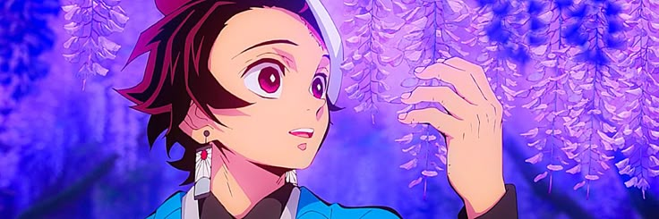

# Tanjiro Portfolio

A vanilla JavaScript personal portfolio website themed around Demon Slayer's Tanjiro Kamado, featuring scroll-scrubbed frame animation, a physics-based custom cursor, and an interactive Nichirin sword rack.

---


---

## [Live Demo](https://tanjiropersonal.netlify.app)

**Deploy in 30 seconds:** drag the folder to [Netlify Drop](https://app.netlify.com/drop), [Vercel](https://vercel.com/new), or `npx surge .`

---

## Quick Start

```bash
# No build step, no dependencies
npx serve .
```


# or

```bash
python -m http.server 8000
```


Open `http://localhost:3000` (or 8000). That's it.

---

## Features

- **300-frame canvas animation scrubbed to scroll** — GSAP ScrollTrigger pins the section and advances frames 1:1 with scroll position; dual portrait/landscape asset sets


- **Physics-based custom cursor** — 20 trailing circles with spring interpolation and gradient color mapping; auto-disables on touch devices


- **Interactive Nichirin sword rack** — 5 swords as portfolio items; click opens a glassmorphism modal with dynamic content (book link, YouTube playlist, or stats)


- **Full glassmorphism system** — Consistent `backdrop-filter: blur(20px)` across navbar, hero overlay, bio card, and stats modal

- **Responsive at 5 breakpoints** — 1023/900/768/600/390px with layout shifts (grid→stack, carousel hide, drawer navbar, label hide)

---

## Run Locally

### Requirements
- Any static file server (Node, Python, PHP, Go, etc.)
- No Node/Python version constraints — pure HTML/CSS/JS

### Commands

```bash
# Option 1: Node (serves on :3000)
npx serve .

# Option 2: Python (serves on :8000)
python -m http.server 8000

# Option 3: PHP (serves on :8000)
php -S localhost:8000
```

### Assets Note
The canvas animation preloads **600 images** (300 landscape + 300 portrait frames). First load may take 5–10s on slow connections. For development, reduce `frameCount` in `script.js:91` to a smaller number.

---

## How It Works

### Scroll-Scrubbed Frame Animation
Instead of video, the "Who Am I" section uses a `<canvas>` rendering 300 preloaded PNG frames. GSAP's `ScrollTrigger` maps scroll progress → frame index with `scrub: 0.5`, creating a buttery frame-perfect animation that feels like video but responds to scroll direction/speed instantly.

### Custom Cursor Physics
20 circles follow the mouse with a spring-damper model: each circle chases the previous one at 30% of the distance per frame (`requestAnimationFrame`). Scale decreases linearly from front to back. Zero dependencies, ~40 lines.

### Sword Rack Data Model
All sword content lives in HTML `data-*` attributes — no JS objects to maintain. One click handler reads `data-type` and renders the appropriate modal template (book button, song list, or plain stats). Adding a sword = one HTML block.

### Glassmorphism Consistency
Three reusable glass patterns defined in CSS:
- `.glass-box` (hero overlay)
- `.Introduction-para` (bio card)
- `.stats-modal` (sword detail)

Each uses identical `backdrop-filter`, border, and shadow values — change one place, updates everywhere.

---

## Credits

| Asset / Library | Source |
|-----------------|--------|
| GSAP 3.12.5 + ScrollTrigger | [GreenSock](https://greensock.com/gsap/) |
| DM Sans, Sekuya, Titillium Web, Black Ops One | [Google Fonts](https://fonts.google.com/) |
| Blood Crow Condensed | Base64-embedded in CSS (woff2 + woff) |
| Hero video | Self-captured / generated |
| Nichirin sword illustrations | Custom / fan assets |
| Haganezuka character art | Demon Slayer franchise (Ufotable) |
| Frame sequence (300 frames) | Generated via ezgif / custom pipeline |

---

## Accessibility Status

- [ ] `prefers-reduced-motion` — disable cursor, reduce animation duration
- [ ] Focus-visible styles for keyboard navigation
- [ ] ARIA labels on sword slots (currently `data-*` only)
- [ ] Alt text on decorative images

---

## License

MIT — use, modify, ship your own themed portfolio.

---

*Sun Breathing 12th Form - Flame DANCE!!!!*